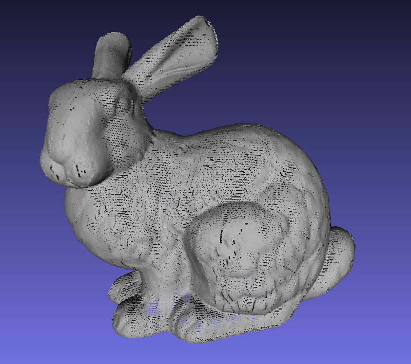
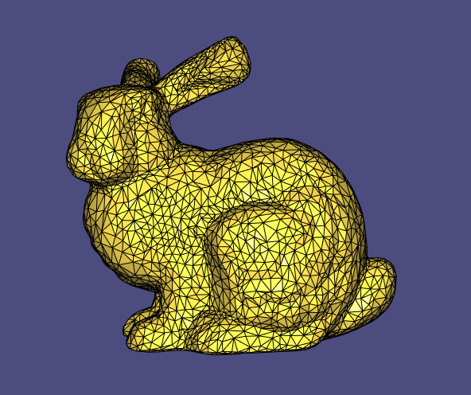
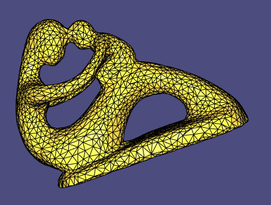
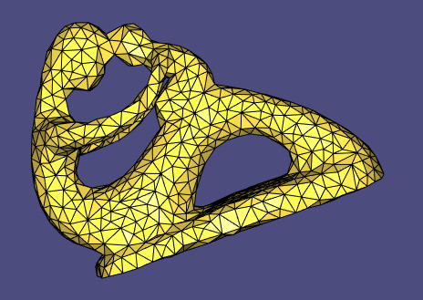
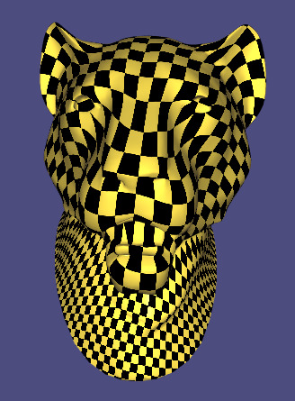
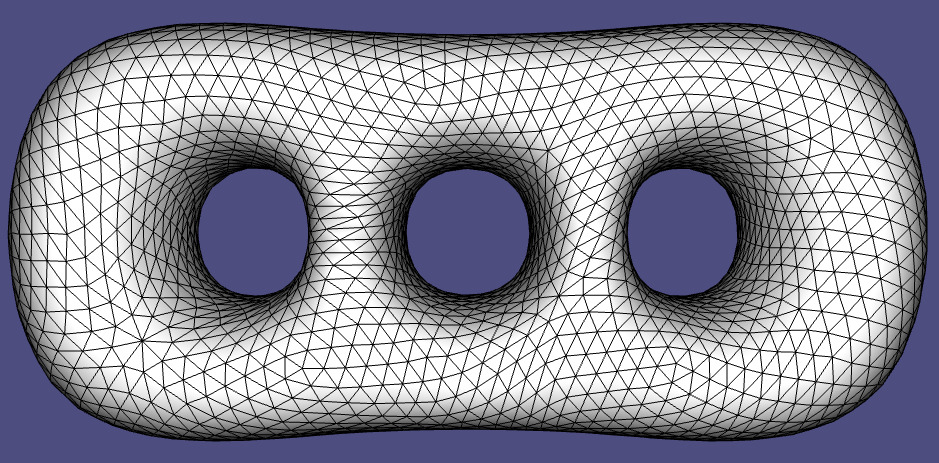

title: Geometry Processing Course
author: Klint Qinami, Alec Jacobson
html header:  <link rel="stylesheet" href=style.css>

# Geometry Processing

Winter Term 2017  
CSC2521 [Topics in Computer Graphics: Geometry Processing]  
Prof. Alec Jacobson  

_This course page is a work in progress. Stay tuned._

This geometry processing course focuses on developing and implementing
mathematically derived algorithms to manipulate virtual geometrical models.
Engineers, computer scientists, artists, physicists,  architects,
neuroscientists, and curious students alike need these algorithms to be robust,
efficient, and visually pleasing. Even with such a variety of users processing
mesh geometry, there is a common user pipeline that emerges, and this course
will focus particularly on developing a cohesive understanding of each stage of
the pipeline.

## Organization

Students will attend lectures where exposition and mathematical derivations are
given, and are expected to complete weekly programming assignments implementing
derived algorithms. By the end of the semester, they should be able to have a
finalized creative piece of geometry that they can 3D print or use virtually,
utilizing their newly developed toolset. There also may be a short in-class
exam that should be relatively easy for students who attended lecture and
worked through the derivations.

## Objectives

 1. Students should understand, derive, and implement solutions to the
 prominent challenges that arise in geometry processing applications.
 2. Students should create a final creative project showcasing their
 implementation of the different processing algorithms.
 3. Students should develop an understanding of the mathematical underpinnings
 of geometry processing including useful discretized operators and energies.
 4. Students should develop a working knowledge of
 [libigl](http://libigl.github.io/libigl/) to develop these algorithms without
 worrying about the grunt-work of
 [OpenGL](https://en.wikipedia.org/wiki/OpenGL) viewers, quadrature, etc.

## Topics

### 1\. Acquisition and Reconstruction

Recent developments in scanning technology have dramatically increased our
capability to faithfully represent real-world objects virtually. Take the
Stanford Bunny,

which can be scanned into a cloud of 3D coordinates by a laser scanner. We can then construct the mesh using a standard Poisson Surface Reconstruction to get

 

The last image shows the bunny mesh being viewed in `libigl`. 

### 2\. Surface Fairing and Denoising

If the scan was not so good, it is possible that the final mesh surface is
noisy. To illustrate this point, I have artificially introduced random noise to
the vertices of the bunny mesh. To fix this, I ran one step of implicit mean
curvature flow to smooth the bunny

 

We can also get carried away and continue smoothing the geometry to get

### 3\. Mesh Simplification

Some algorithms demand such computing power that it may be reasonable to reduce
the complexity of our mesh by representing the geometry with fewer faces. Using
a greedy algorithm to assign edge collapse weights, we can achieve remarkably
nice results as shown on this fertility mesh

### 4\. Mesh Parametrization

Remarkably, using the smoothing machinery and tweaking a bit, we can create 2D
parametrizations for our 3D surfaces. If we have a mesh with a boundary, one
simple technique we can use is to map the boundary to the unit circle and then
place the remaining vertices within the disk in such a way that we minimize
displacement. Using the Dirichlet Energy as a measure, we can achieve harmonic
parametrization of this Lion mesh

Because we restrict the boundary, this method can cause the parametrization to
warp angles and areas. Using a Least Squares Conformal Mapping, we can free the
boundary, show below on the left. Even beyond freeing the boundary, we can come
up with an As Rigid As Possible parametrization and use LSCM as a starting
point to improve upon, shown below on the right.

This parametrization can be used to overlay textures onto the original surface,
as it is already a planar representation of our three dimensional object.
Because of our choice of energies and physically based techniques, we can be
sure to get as little distortion in the mapping as we aimed for angle and area
preservation.

### 5\. Remeshing

Even though it may seem like triangle meshes are in fact all we ever work with,
there is no reason to restrict ourselves. In fact, there are sometimes benefits
to working with quadrilateral meshes instead. Due to this, there is quite a bit
of literature on developing good remeshing algorithms. Here is an example of
the transformation from a triangle mesh to a quad mesh

### 6\. Visualizing Mesh Features

The automatic detection of mesh features like symmetry, curvature, and
spin-axes are also useful tools for mesh analysis. Here is a plot of elliptic,
hyperbolic, and parabolic curvature on a bumpy square mesh

  

### 7\. Deformations

Mesh deformation techniques allow users to create new meshes by deforming
existing ones. This has especially important implications for character
animations. Handle-based deformations allow users to specify the positions of a
few predetermined handle points and allows the algorithm to deduce the rest.
Creating physically plausible deformations of characters is a challenging task,
and often sophisticated mathematical concepts are hidden behind simple uses
interfaces. Here's a deformation of a knight character using an As Rigid As
Possible scheme

### A Mathematical Foundation

Much of the framing for our techniques will be looking at the continuous
analogue of our problem and discretizing it in an intrinsic way, preserving
continuous theorems as much as possible. We will discretize continuous
operators like the Laplacian and the Gradient, and we will find adequate
representations of concepts like normal vectors and curvature. Perhaps
surprisingly we will see that there are many choices of discretization, each
with their own benefits and downsides, prompting us to choose appropriately for
the particular application.

### Prerequisites

Students should be comfortable with Linear Algebra and Multivariable Calculus,
and while knowledge of Partial Differential Equations is not required, it will
certainly be very handy for derivations. A quick survey will be posted to help
students evaluate their readiness on these topics.

On the programming side, we will be coding mainly in `C++` and using a
miniature version of `Libigl`, an open-source geometry processing library. We
will be using `Eigen` for computational linear algebra, and `Cmake` for linking
and developing executables.

### Supplemental Textbook

[_Polygon Mesh
Processing_](https://www.amazon.ca/Polygon-Mesh-Processing-Mario-Botsch/dp/1568814267/).
Mario Botsch, Leif Kobbelt, Mark Pauly, Pierre Alliez, and Bruno Levy, 2008.
